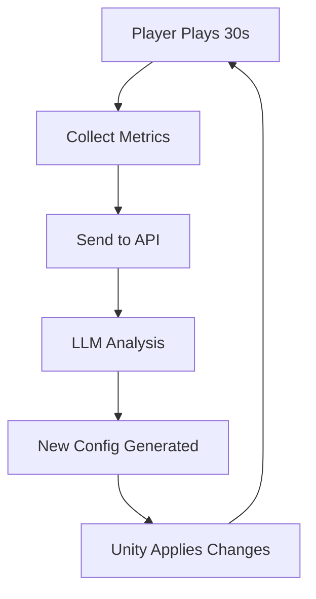

# Block Survivor - AI-Powered Game API

> Real-time AI difficulty adjustment for Block Survivor using 0G Network LLM  
> **Game created for EthGlobal Cannes 2025**

  

## 🎮 Overview

Block Survivor is an innovative survival game that uses AI to dynamically adjust difficulty in real-time based on player performance. Every 30 seconds, the game analyzes player metrics and uses a decentralized LLM (via 0G Network) to generate new terrain and boss configurations that maintain optimal challenge and engagement.

### 🌟 Key Features

- **🤖 AI-Powered Difficulty Scaling**: LLM analyzes player performance and adjusts game difficulty
- **🌍 Dynamic Terrain System**: Three terrain types with unique gameplay effects
- **⚡ Real-time Adaptation**: Configuration updates every 30 seconds based on player metrics
- **🔗 Decentralized AI**: Powered by 0G Network's compute infrastructure
- **📊 Performance Tracking**: Comprehensive player analytics (APM, dodge rate, reaction time)
- **🛡️ Fallback System**: Graceful handling when LLM is unavailable

## 🎯 How It Works



### Terrain Types

| Terrain       | Effect                                     | Best For                                 |
| ------------- | ------------------------------------------ | ---------------------------------------- |
| **🟢 Smooth** | Fast movement, less control (player slips) | Helping struggling players escape        |
| **🔴 Sticky** | Slow movement, hard to escape attacks      | Precision challenges for skilled players |
| **🟤 Rugged** | Normal control, balanced terrain           | Default/intermediate difficulty          |

### Boss Configuration

- **Speed** (1-100): How fast the boss attacks
- **Health** (50-500): Boss durability
- **Damage** (5-50): Attack damage dealt to player
- **Shield** (0-100): Damage reduction for boss

## 🚀 Quick Start

### Prerequisites

- Node.js 18+
- 0G Network account with private key
- Sufficient 0G Network balance for LLM calls

### Installation

```bash
# Clone the repository
git clone <your-repo-url>
cd block-survivor-api

# Install dependencies
npm install

# Setup environment variables
cp .env.example .env
# Edit .env and add your PRIVATE_KEY

# Build the project
npm run build

# Start the server
npm start
```

The API will be available at `http://localhost:4000`

## 📚 API Documentation

### Quick Reference

| Endpoint               | Method | Description                  |
| ---------------------- | ------ | ---------------------------- |
| `/api/game/start`      | POST   | Start new game session       |
| `/api/game/:id/update` | POST   | Send metrics, get new config |
| `/api/game/:id/config` | GET    | Get current configuration    |
| `/api/game/:id/end`    | POST   | End game session             |
| `/docs`                | GET    | Full API documentation       |

### Example Usage

#### 1. Start Game

```bash
curl -X POST http://localhost:4000/api/game/start \
  -H "Content-Type: application/json" \
  -d '{"playerId": "player-123"}'
```

#### 2. Send Player Metrics (Every 30 seconds)

```bash
curl -X POST http://localhost:4000/api/game/SESSION_ID/update \
  -H "Content-Type: application/json" \
  -d '{
    "apm": 145,
    "dodgeRatio": 0.85,
    "round": 3,
    "distanceTraveled": 1200,
    "reactionTime": 0.2,
    "damageDealt": 180
  }'
```

#### 3. Response (New AI-Generated Config)

```json
{
  "success": true,
  "config": {
    "terrain": {
      "type": "sticky",
      "movementModifier": 0.7
    },
    "boss": {
      "speed": 75,
      "health": 180,
      "damage": 18,
      "shield": 25
    }
  },
  "llm_used": true,
  "round": 3
}
```

## 🧪 Testing

### Quick LLM Test

```bash
node test-llm.js
```

### Game Simulation

```bash
# Test specific player skill level
node simulate-game.js expert 5        # Expert player, 5 rounds
node simulate-game.js beginner 3      # Beginner player, 3 rounds

# Compare all player types
node simulate-game.js comparison
```

### Manual API Testing

```bash
node test-api.js
```

## 🏗️ Architecture

### Project Structure

```
src/
├── config/
│   ├── gameDefaults.ts      # Default game configurations
│   └── swagger.ts           # API documentation config
├── controllers/
│   └── gameController.ts    # Game API endpoints
├── services/
│   ├── gameService.ts       # Session management
│   ├── llmService.ts        # 0G Network LLM integration
│   ├── brokerService.ts     # 0G Network broker
│   └── metricsProcessor.ts  # Player metrics validation
├── routes/
│   └── gameRoutes.ts        # API routing
├── types/
│   └── gameTypes.ts         # TypeScript interfaces
└── index.ts                 # Main server
```

### Key Services

- **GameService**: In-memory session management, config storage
- **LLMService**: 0G Network integration, prompt engineering, response parsing
- **MetricsProcessor**: Player metrics validation and analysis
- **BrokerService**: 0G Network blockchain interactions

## 🎮 Unity Integration

### Game Loop Integration

```csharp
// 1. Start game session
var response = await PostJson("/api/game/start", new { playerId = "player-id" });
string sessionId = response.sessionId;

// 2. Every 30 seconds during gameplay
var metrics = new {
    apm = playerAPM,
    dodgeRatio = dodgedAttacks / totalAttacks,
    round = currentRound,
    distanceTraveled = playerMovement.distance,
    reactionTime = averageReactionTime,
    damageDealt = totalDamageDealt
};

var configResponse = await PostJson($"/api/game/{sessionId}/update", metrics);

// 3. Apply new configuration
ApplyTerrainConfig(configResponse.config.terrain);
ApplyBossConfig(configResponse.config.boss);

// 4. End session when game over
await PostJson($"/api/game/{sessionId}/end", {});
```

## 🤖 LLM Integration Details

### Prompt Strategy

The system sends structured prompts to the LLM including:

- Player performance analysis (APM, dodge rate, skill level)
- Current game configuration
- Detailed terrain effect descriptions
- Strategic difficulty scaling guidance

### Response Handling

- **Success**: Parse JSON config and apply to game
- **Timeout**: Use previous configuration (15-second timeout)
- **Invalid Response**: Log error, apply fallback config
- **Network Error**: Graceful degradation with previous settings

### Expected Performance

- **LLM Response Time**: ~15 seconds
- **Total API Response**: ~16 seconds
- **Fallback Response**: <1 second

## 🔧 Configuration

### Environment Variables

```bash
# Required
PRIVATE_KEY=your_0g_network_private_key

# Optional
PORT=4000
NODE_ENV=development
LOG_LEVEL=info
```

### Game Defaults

- **Starting Terrain**: Rugged (balanced)
- **Starting Boss**: Speed 30, Health 100, Damage 10, Shield 0
- **Session Timeout**: 1 hour
- **LLM Timeout**: 15 seconds

## 📊 Monitoring & Analytics

### Health Check

```bash
curl http://localhost:4000/api/game/health
```

### Session Statistics

```bash
curl http://localhost:4000/api/game/SESSION_ID/stats
```

### Performance Metrics

- Active session count
- LLM success/failure rates
- Average response times
- Player progression tracking

## 🛠️ Development

### Available Scripts

```bash
npm run dev          # Development with auto-reload
npm run build        # Build TypeScript
npm start            # Start production server
npm run clean        # Clean build directory
```

### Adding New Features

1. **New Metrics**: Add to `PlayerMetrics` interface
2. **New Config Options**: Update `GameConfig` and validation
3. **Prompt Improvements**: Modify `LLMService.createPrompt()`
4. **New Endpoints**: Add to `gameController.ts` and `gameRoutes.ts`

## 🌐 Deployment

### Local Deployment

```bash
npm run build
npm start
```

### Docker Deployment

```dockerfile
FROM node:18-alpine
WORKDIR /app
COPY package*.json ./
RUN npm install
COPY . .
RUN npm run build
EXPOSE 4000
CMD ["npm", "start"]
```

### Production Considerations

- Set up proper logging (Winston, etc.)
- Add rate limiting for LLM calls
- Implement persistent session storage if needed
- Monitor 0G Network usage and costs
- Set up health checks and alerts

## 🤝 Contributing

1. Fork the repository
2. Create a feature branch: `git checkout -b feature/amazing-feature`
3. Commit changes: `git commit -m 'Add amazing feature'`
4. Push to branch: `git push origin feature/amazing-feature`
5. Open a Pull Request

## 📄 License

This project is licensed under the MIT License - see the [LICENSE](LICENSE) file for details.

## 🏆 EthGlobal Cannes 2025

Block Survivor was created for EthGlobal Cannes 2025, demonstrating innovative use of:

- **0G Network**: Decentralized AI compute for real-time game adjustments
- **Smart Difficulty Scaling**: LLM-powered adaptive gameplay
- **Web3 Gaming**: Blockchain-integrated game mechanics
- **Real-time AI**: Sub-20-second AI responses for live gameplay

## 🔗 Links

- [0G Network Documentation](https://0g.ai)
- [API Documentation](http://localhost:4000/docs)
- [EthGlobal Cannes 2025](https://ethglobal.com/events/cannes)

## 📞 Support

For questions or support:

- Create an issue in this repository
- Check the API documentation at `/docs`
- Review the test scripts for implementation examples

---

**Built with ❤️ for EthGlobal Cannes 2025 using 0G Network**
